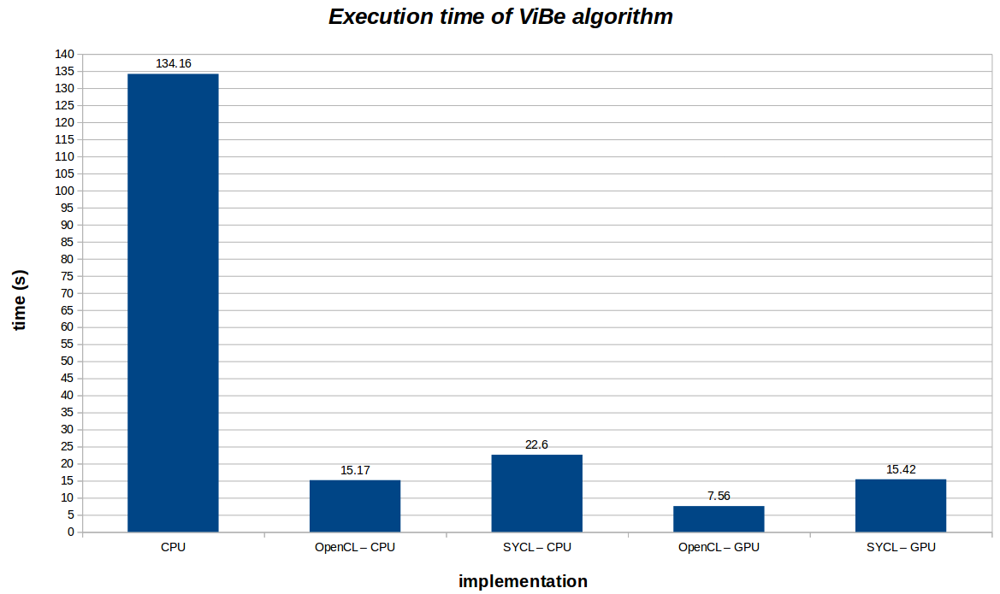
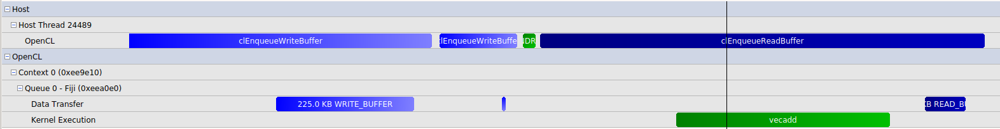
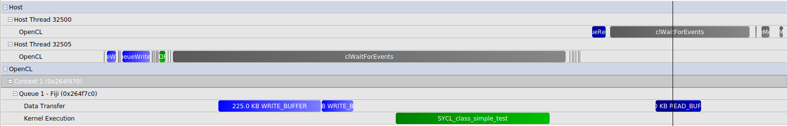

## Comparison between OpenCL and SYCL
---

### OpenCL
_OpenCL_ is a well known framework for writing programs which run on heterogeneous devices, such as multicore CPUs, GPUs, DSPs, FPGAs. Using such devices in an efficient way often speeds up your programs. GPUs are very common today, in any computer, and it's important to benefit from their computing power.

### SYCL
_SYCL_ is a C++ abstraction layer over OpenCL which aims to make OpenCL programming easier. Indeed, SYCL allows developpers to benefit from C++ features and brings "single source" programming style, whereas OpenCL is mainly based on C language (a C++ layer is also available) and requires "kernels" (code which is going to be executed on the device) to be written in another file. As OpenCL, SYCL is a royalty-free specification of the Khronos Group. [Codeplay](https://www.codeplay.com/), a Scottish company, has developped a SYCL implementation (and a compiler for the kernels) called ComputeCpp. It is not open-source but a "Community Edition" is available on their website.

On one hand, SYCL makes the developpment easier (C++ and single source style), but on the other hand, it affects negatively the global performance. So, it is interesting to estimate the loss in performance invloved by the use of SYCL.

### ViBe : Background substraction

To do that, I chose a method for which using a GPU should probably be beneficial : **[ViBe](https://orbi.ulg.ac.be/bitstream/2268/145853/1/Barnich2011ViBe.pdf)**
This is used in computer vision for background substraction and detection.

This method is based on image processing, so doing a same operation on every pixel of an image (frame). This kind of process  called SIMD (Single Instruction Multiple Data) benefits a lot from GPUs usage. Indeed, GPUs can execute a same operation many time in parallel.

I developped 3 versions of the ViBe algorithm, with use of the computer vision library OpenCV :
- Baseline implementation which executes on the CPU (single-thread)
- OpenCL implementation which executes on the GPU or CPU (multi-threade)
- SYCL implementation which executes on the GPU or CPU (multi-thread)

The configuration used:
- Hardware :
  - CPU : Intel(R) Core(TM) i7-4770 CPU @ 3.40GHz
  - GPU : AMD R9 Fury Nano

- Software :
  - OS : Ubuntu 14.04
  - OpenCL : AMD implementation (AMD driver fglrx-15.302)
  - OpenCL 2.0 (GPU) and 1.2 (CPU)
  - SYCL Codeplay implementation : ComputeCpp 0.2.0

Here are the results obtained (with all graphical output disabled)

Obviously the worst result (almost 135s) is obtained with the baseline implementation on the CPU (single thread). Using the hardware in a more efficient way increases a lot the performance.
First, if we look at the CPU. 
With OpenCL, the CPU is more efficiently used : several threads are launched on the different CPU cores. ViBe is almost 9 times faster in this case. Using SYCL add a litte overhead of almost 50% compared to raw OpenCL.
Results are even better when using GPU, because this kind of device can launch much more thread simultaneously compared to the CPU (Multi-cores vs Many-cores). OpenCL with GPU gives the best result : 7.56 s (almost 18 times better than the baseline). The overhead added by SYCL is around 100%.

### RCP
_RCP_ (Radeon Compute Profiler) is an opensource performance analysis tool developped by AMD.
It allows you to gather information about the runtime OpenCL API. Other information like GPU kernel performance counters or GPU occupancy can also be obtained.
Thanks to this tool, we can compare the OpenCL API calls for both version : 

- OpenCL :

- SYCL :

The two timelines represent, one process iteration of the ViBe algorithm : for all pixel of the frame, determine if it belongs to the background or foreground and update background model.
The duration is around _0.3 ms_ for the SYCL version and around _0.275 ms_ for the OpenCL version.
For the OpenCL timeline, we can easily recognize the API calls used in our code, whereas with SYCL all the OpenCL calls are made by the libComputeCPP.so from Codeplay.

